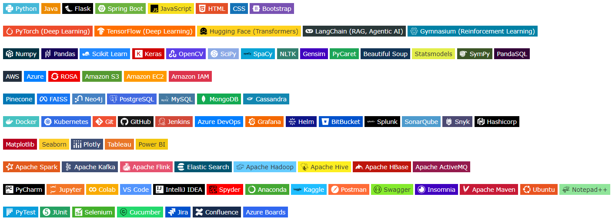

<h1 align="center">Hi, I'm Aditya Sreevatsa K!</h1>

  

<h2 align="center">
  <em>AI/ML Engineer | Turning Research into Production-Ready AI</em>
</h2>

---

## 🔭 What I'm Working On

| Project                                                                                                     | Description                                                      |
|:------------------------------------------------------------------------------------------------------------|:-----------------------------------------------------------------|
| 🤖 [RAG-Foundry](https://github.com/AdityaSreevatsaK/RAG-Foundry)                                           | Forging practical Retrieval-Augmented Generation (RAG) pipelines |
| 🚀 [The-Neural-Nexus](https://github.com/AdityaSreevatsaK/The-Neural-Nexus)                                 | Cutting-Edge Deep Learning Lab                                   |
| 🧠 [NLP-Navigator](https://github.com/AdityaSreevatsaK/NLP-Navigator)                                       | Real-World NLP Applications                                      |
| ⚙️ [PySpark-Pipeline](https://github.com/AdityaSreevatsaK/PySpark-Pipeline)                                 | Big Data ML with PySpark                                         |
| 🎯 [Suggestify-RecommendationSystems](https://github.com/AdityaSreevatsaK/Suggestify-RecommendationSystems) | Scalable Recommender Engines                                     |
| 🧪 [Applied-AI-Lab](https://github.com/AdityaSreevatsaK/Applied-AI-Lab)                                     | End-to-End AI/ML Experimentation                                 |
| 📊 [DS-ML-Playground](https://github.com/AdityaSreevatsaK/DS-ML-Playground)                                 | Diverse ML Problem Solving                                       |
| 🍃 [MongoDB-Mechanics](https://github.com/AdityaSreevatsaK/MongoDB-Mechanics)                               | NoSQL Data Handling for ML                                       |
| 🐍 [100DaysOfCode-Python](https://github.com/AdityaSreevatsaK/100DaysOfCode_Python)                         | Rapid Python Mastery Journey                                     |
| 🛠️ [Useful-Code-Snippets](https://github.com/AdityaSreevatsaK/Useful-Code-Snippets)                        | Production-Ready Code Boosters                                   |

---

## 📌 Highlights

* 🎯 Specialising in **Generative AI** and **Agentic AI**, with a focus on building autonomous systems for financial
  analysis (`AlphaAgent`) and urban mobility (`SmartFlow`).
* 🛠️ Skilled in **productionising machine learning models**, from building on live **Kafka** streams to deploying and
  scaling with **Docker** and **Kubernetes**.
* 🏢 Proven track record of delivering AI/ML solutions in large-scale **enterprise environments** within the financial
  services and energy sectors.
* 🌟 Committed to engineering excellence with a passion for writing **clean, scalable, and production-ready code**.

---

## 🧠 Core Expertise

* **Generative AI & NLP:** Specialising in building and deploying advanced systems using LLMs, Retrieval-Augmented
  Generation (RAG), and Agentic AI frameworks.
* **Deep Learning & Applied ML:** Deeply versed in Deep Learning (PyTorch, TensorFlow) and a range of ML domains
  including Reinforcement Learning, Computer Vision, and Recommender Systems.
* **End-to-End MLOps:** Experienced in the full model lifecycle, including containerisation (Docker), orchestration (
  Kubernetes), CI/CD pipelines, and cloud deployment (AWS, Azure).
* **Big Data & Real-Time Processing:** Skilled in engineering scalable data pipelines for machine learning using Apache
  Spark, Apache Kafka, and distributed systems.

---

## 🛠️ Tools & Technologies

---

## 🧪 Research & Innovation

* 📄 Architecting **AlphaAgent**, an autonomous financial analyst that integrates Retrieval-Augmented Generation (RAG)
  with quantitative tools.
* 📄 Developing **SmartFlow**, a hybrid framework that uses Reinforcement Learning and Agentic AI to optimise urban
  mobility systems.
* 📌 Exploring hybrid frameworks that combine Machine Learning with traditional Operations Research for optimised
  decision-making.
* 🧬 Passionate about bridging the gap between theoretical research and impactful, real-world applications.

---

## 📈 GitHub Stats

    <table>
        <tr>
            <td>
                
            </td>
            <td>
                
            </td>
        </tr>
    </table>

---

## 🌐 Find Me Here

    <a href="https://adityasreevatsak-mle.netlify.app/" target="_blank">
        <button style="background-color: #000; color: white; border: none; padding: 2px 2px; border-radius: 3px; display: flex; align-items: center; font-size: 12px;">
            
            Live Portfolio
        </button>
    </a>
    
    

